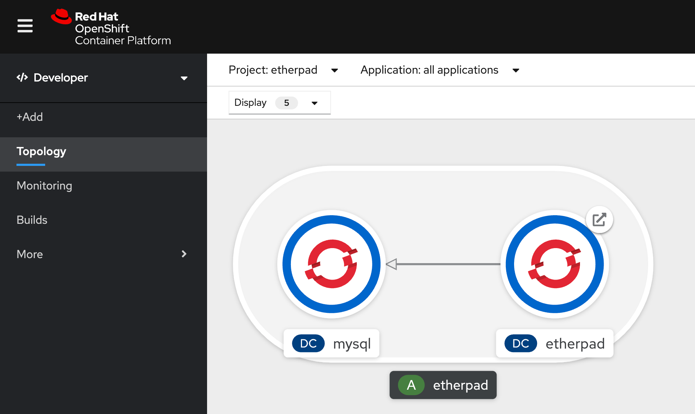
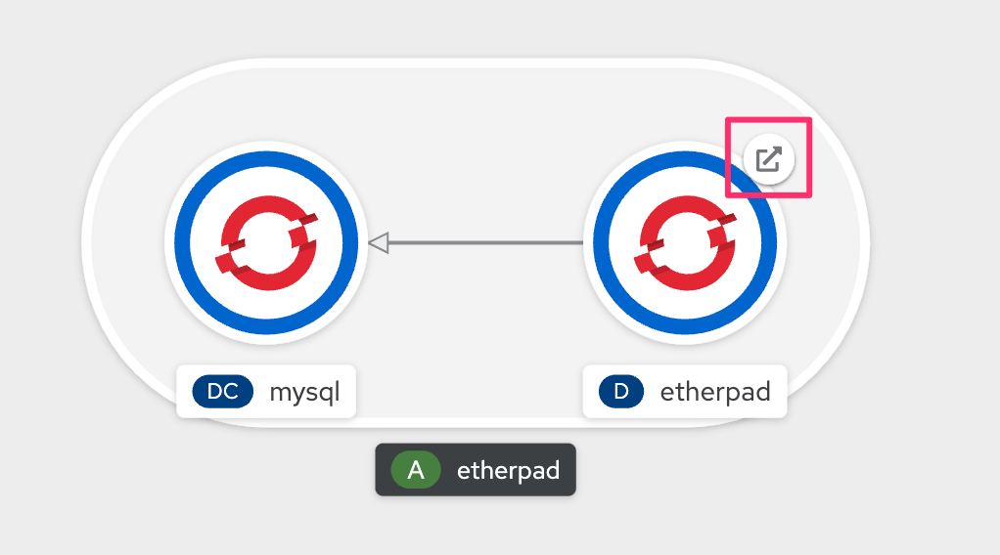

# Etherpad on Openshift

This is a simple repo describing how you can deploy etherpad-lite for your workshops.



## Instructions

### Using oc and Bash

```bash
ETHERPAD_PROJECT=etherpad
ETHERPAD_VERSION=1.8.4
ETHERPAD_APP_NAME=etherpad

# Creating project
oc new-project ${ETHERPAD_PROJECT} --display-name "Etherpad"

# Creating persistent database
oc new-app \
    mysql-persistent \
    --param MYSQL_USER=ether \
    --param MYSQL_PASSWORD=ether \
    --param MYSQL_DATABASE=ether \
    --param VOLUME_CAPACITY=2Gi \
    --param MYSQL_VERSION=5.7 \
    -n ${ETHERPAD_PROJECT}

# Wait for the database to be ready
sleep 45

# Creating etherpad
oc new-app \
    --name=${ETHERPAD_APP_NAME} \
    docker.io/etherpad/etherpad:${ETHERPAD_VERSION} \
    DB_TYPE=mysql \
    DB_HOST=mysql \
    DB_PORT=3306 \
    DB_USER=ether \
    DB_PASS=ether \
    DB_NAME=ether \
    ADMIN_PASSWORD=supersecret \
    -n ${ETHERPAD_PROJECT}

# Creating route for etherpad
oc expose svc ${ETHERPAD_APP_NAME} -n ${ETHERPAD_PROJECT}

# Grouping mysql and etherpad on the same application
oc label dc ${ETHERPAD_APP_NAME} app.kubernetes.io/part-of=${ETHERPAD_APP_NAME} -n ${ETHERPAD_PROJECT}
oc label dc mysql app.kubernetes.io/part-of=${ETHERPAD_APP_NAME} -n ${ETHERPAD_PROJECT}
oc annotate dc ${ETHERPAD_APP_NAME} app.openshift.io/connects-to=mysql-persistent -n ${ETHERPAD_PROJECT}

# On Openshift 4.5 or when using Kubernetes vanilla, you may need to adjust the commands above to use deployment instead of deploymentconfig. Below are the examples:
oc label deploy ${ETHERPAD_APP_NAME} app.kubernetes.io/part-of=${ETHERPAD_APP_NAME} -n ${ETHERPAD_PROJECT}
oc label deploy mysql app.kubernetes.io/part-of=${ETHERPAD_APP_NAME} -n ${ETHERPAD_PROJECT}
oc annotate deploy ${ETHERPAD_APP_NAME} app.openshift.io/connects-to=mysql-persistent -n ${ETHERPAD_PROJECT}

# On MacOs
open http://$(oc get route ${ETHERPAD_APP_NAME} -o jsonpath='{.spec.host}')
```

You should see now the following screen


To open Etherpad, click on the arrow for the Etherpad pod:



### Creating list of Users

Use the following script to generate a list of users.

```bash
# Change this according to the number of users
NUMBER_OF_USERS=20

for userNumber in $(seq 1 $NUMBER_OF_USERS);do
  echo "user${userNumber}="
done
```

You should see the following output. Use it in your etherpad.

```bash
user1=
user2=
user3=
user4=
user5=
user6=
user7=
user8=
user9=
user10=
user11=
user12=
user13=
user14=
user15=
user16=
user17=
user18=
user19=
user20=
```
