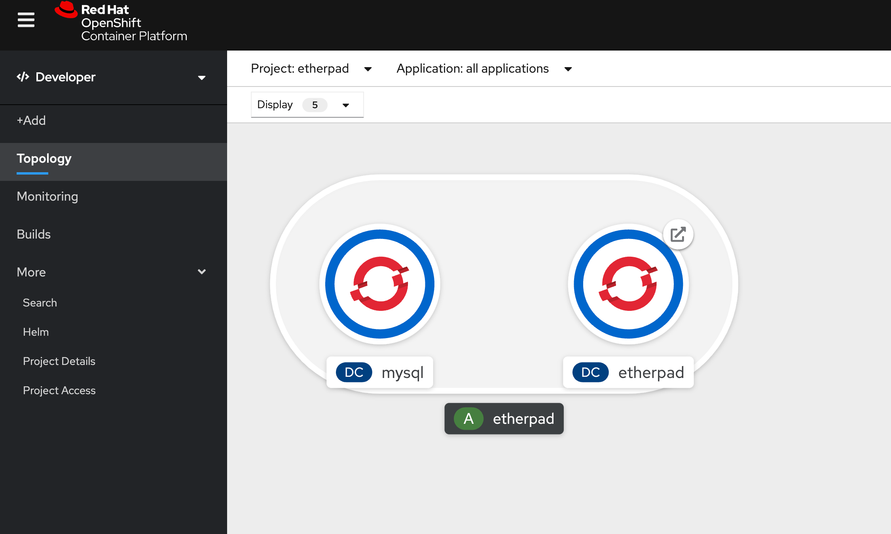

# Etherpad on Openshift

This is a simple repo describing how you can deploy etherpad-lite for your workshops.



## Instructions

### Using oc and Bash

```bash
ETHERPAD_PROJECT=etherpad
ETHERPAD_VERSION=1.8.4
ETHERPAD_APP_NAME=etherpad

# Creating project
oc new-project ${ETHERPAD_PROJECT} --display-name "Etherpad"

# Creating persistent database
oc new-app \
    mysql-persistent \
    --param MYSQL_USER=ether \
    --param MYSQL_PASSWORD=ether \
    --param MYSQL_DATABASE=ether \
    --param VOLUME_CAPACITY=2Gi \
    --param MYSQL_VERSION=5.7 \
    -n ${ETHERPAD_PROJECT}

# Wait for the database to be ready
sleep 45

# Creating etherpad
oc new-app \
    docker.io/etherpad/etherpad:${ETHERPAD_VERSION} \
    DB_TYPE=mysql \
    DB_HOST=mysql \
    DB_PORT=3306 \
    DB_USER=ether \
    DB_PASS=ether \
    DB_NAME=ether \
    ADMIN_PASSWORD=supersecret \
    -n etherpad

# Creating route for etherpad
oc expose svc etherpad -n ${ETHERPAD_PROJECT}

# Grouping mysql and etherpad on the same application
oc label dc etherpad app.kubernetes.io/part-of=${ETHERPAD_APP_NAME} -n ${ETHERPAD_PROJECT}
oc label dc mysql app.kubernetes.io/part-of=${ETHERPAD_APP_NAME} -n ${ETHERPAD_PROJECT}

# On MacOs
open http://$(oc get route etherpad -o jsonpath='{.spec.host}')
```

You should see the following screen


### Using Ansible

### Creating list of Users

Use the following script to generate a list of users.

```bash
NUMBER_OF_USERS=20

for userNumber in $(seq 1 $NUMBER_OF_USERS);do
  echo "user${userNumber}="
done
```